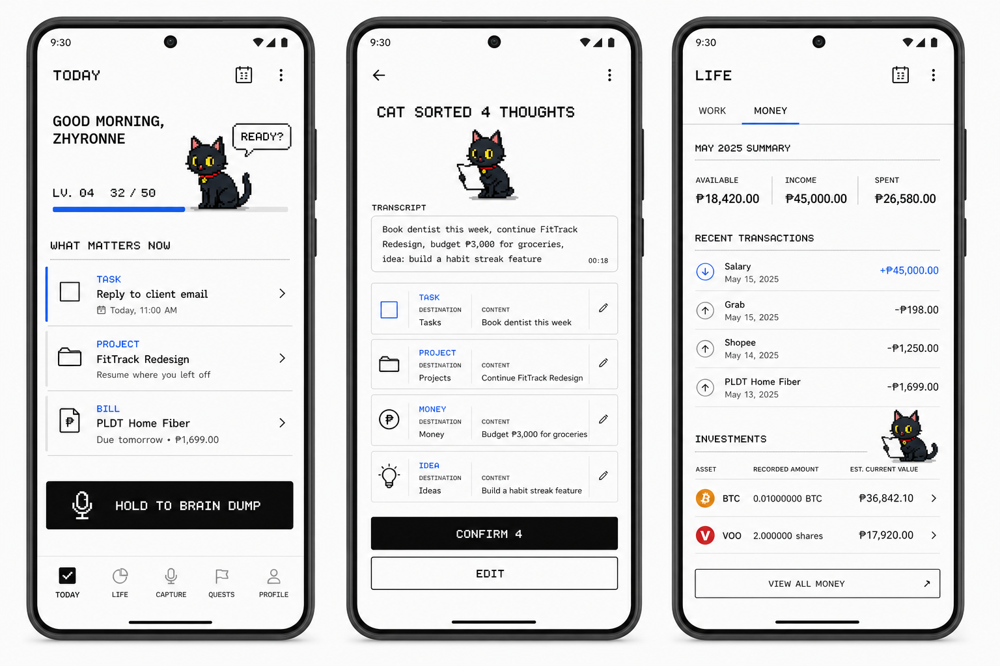

# Mewmo Pixel Rebrand & Personal OS Roadmap

> Status: approved for implementation on August 18, 2026. The local-first product baseline through Projects, Money, Investments, review-before-commit, and gamification has been implemented; hosted backend deployment and store release remain separate release work.
>
> Product name: **Mewmo** — “mew” + “memo.” The black cat's name remains an open decision.

## Recommendation

Evolve Mewmo into a **personal quest log**: one calm place where a person speaks naturally, reviews what the app understood, and lets the black cat organize the result into today's priorities, project memory, reminders, ideas, notes, or money records.

The product should remain useful before it becomes playful. Gamification should reinforce real progress, reflection, and clarity; it should never trivialize money, manufacture anxiety, or reward investment performance.

The black cat is not decorative. It is the product's guide and visible state indicator:

- listening while the user records;
- sorting while AI processes a dump;
- presenting uncertain items for review;
- remembering where project work stopped;
- celebrating genuine completion;
- resting when nothing needs attention;
- explaining recoverable errors without blaming the user.

The defining promise is:

> **I talked, and my life became organized.**

## Product principles

1. **Voice capture remains the center.** New domains extend the existing capture loop rather than becoming unrelated mini-apps.
2. **Today answers one question:** “What matters right now?” It is not a dashboard full of decorative widgets.
3. **Review before commitment.** AI can suggest destinations, dates, categories, projects, and amounts, but the user confirms sensitive or ambiguous records.
4. **Recorded and estimated values stay visibly different.** This is especially important for investments and market prices.
5. **One real-world event creates one accounting trail.** An investment contribution can link a cash outflow and an investment lot, but must not be counted twice.
6. **Playfulness surrounds the work; it does not rename serious facts.** Use “expense,” “balance,” and “gain/loss” in Money. Do not turn finances into coins, loot, or gambling language.
7. **Local-first and recoverable.** The app should work without a connection where possible, preserve original voice notes, and support export/backup before it becomes a trusted financial record.
8. **The cat never guilt-trips.** Missed days do not erase progress or trigger shame-based copy.

## Visual direction

The visual language should come directly from the portfolio and supplied cat sprites, not from a generic “AI app” style.

### Visual reference

This board is directional, not a final specification. It demonstrates three important moments: Today, capture review, and Money. Labels, amounts, navigation names, and the cat's dialogue remain editable.

### Palette

| Role | Color | Use |
| --- | --- | --- |
| Canvas | `#FAFAFA` | Main app background |
| Surface | `#FFFFFF` | Sheets, input areas, and focused content |
| Ink | `#111111` | Primary text, borders, and primary buttons |
| Secondary ink | `#555555` | Supporting copy and metadata |
| Rule | `#E5E5E5` | Separators and quiet structure |
| Focus blue | `#2563EB` | Selection, focus, progress, and active navigation |
| Character colors | Existing cat red/yellow/pink | Mascot only, except for genuine semantic states |

The dominant experience stays white and black. Blue is a functional accent rather than a decorative wash. Avoid purple, neon, gradients, glow, glass surfaces, and trading-dashboard visuals.

### Typography

- Use a pixel or bitmap-inspired display font only for short headings, status labels, levels, and playful cat dialogue.
- Keep paragraphs, transcripts, forms, and financial information in a highly readable sans-serif.
- Use tabular numerals for amounts, quantities, dates, and timers.
- First font spike should compare **Pixelify Sans** and **Silkscreen** on a real Android phone before selecting one.
- Never use an all-pixel font for long copy or dense finance screens.

### Layout and components

- Prefer whitespace, alignment, and 1-pixel rules to nested rounded cards.
- Use mostly square or lightly rounded controls, with large platform-appropriate touch targets.
- Reserve solid black for the primary action and blue for active/focus states.
- Keep the central voice capture action prominent and thumb-reachable.
- Make the cat present without allowing it to cover content or controls.
- Show long transcripts, large amounts, empty states, errors, offline states, and text scaling in design reviews—not only the ideal happy path.

### Cat art and motion

The existing sprites are the identity source and should be reused before generating replacements:

- `black-cat-sprites.png`
- `black-cat-atlas-v2.png`
- `cat-hands-up.png`

Implementation should first audit and map the supplied atlas. New poses should be generated only when a required state is genuinely missing, and they must preserve the cat's silhouette, collar, bell, eye color, palette, pixel density, and transparent background.

Animation rules:

- render at integer scale factors where possible;
- use nearest-neighbor/pixelated sampling with no smoothing;
- use deliberate stepped animation, generally around 6–10 frames per second;
- animate to explain a state change, acknowledge input, or celebrate an outcome;
- provide a reduced-motion/static equivalent;
- do not leave the cat continuously moving when it competes with reading or increases battery use.

Suggested cat states are idle, listening, sorting, uncertain, inspecting, resuming work, celebrating, resting, offline, and recoverable error.

## Experience architecture

### Recommended navigation

Keep the mobile navigation compact:

1. **Today** — priorities and the next useful action.
2. **Life** — a hub with Work and Money sections.
3. **Capture** — the central Mewmo action.
4. **Activity** — a meaningful history of completed work and confirmed records.
5. **Profile** — preferences, privacy, backup/export, cat settings, and gamification controls.

Global search can live in the header instead of consuming a permanent navigation slot.

### The core Mewmo flow

1. The user records or types a natural thought.
2. The original capture is saved before processing begins.
3. AI returns structured **suggestions**, not committed records.
4. A review screen shows the transcript and every proposed destination.
5. The user edits, removes, or confirms suggestions.
6. Confirmed records are written together and linked to the original capture.
7. A result screen summarizes what changed and offers Undo.
8. The cat reacts to the outcome, not to the presence of AI.

Example:

> “Tomorrow remind me to pay the electric bill, I put ₱2,000 into VOO today, and the login screen still needs an empty state.”

The review can propose:

- one bill reminder;
- one linked cash/investment transaction;
- one note or task in the correct project.

Nothing financial is committed until the user verifies the amount, asset, date, and source account.

## Gamification model

The theme is **momentum**, not competition. Levels and rewards represent care taken with one's life, not productivity volume.

| Real action | Feedback | Cat response | Guardrail |
| --- | --- | --- | --- |
| Confirm a reviewed recording | Small momentum/XP award | Cat sorts a paper | Once per completed recording; no reward for splitting spam |
| Complete a real priority | Momentum/XP | Hands-up or heart pose | Only after a state transition from incomplete to complete |
| Save a project handoff note | Momentum/XP | Cat inspects the note | Once per work session |
| Complete a weekly reflection | Cosmetic progress | Yarn/rest animation | No penalty when skipped |
| Correct an AI suggestion | Positive acknowledgement | Cat nods/learns | Never frame correction as failure |

Recommended mechanics:

- gentle levels with transparent progress;
- cosmetic cat expressions, desk objects, and dialogue variations;
- daily reward caps and idempotent reward events;
- a “rhythm” or “recent momentum” view instead of a streak that resets to zero;
- an option to disable XP, levels, celebrations, or all mascot motion;
- an activity log explaining exactly why progress changed.

Explicitly exclude:

- leaderboards and social comparison;
- loss-aversion streaks;
- random paid rewards or loot-box behavior;
- XP for spending money, buying investments, market gains, or number of transactions;
- shame, sad-cat coercion, or manipulative notifications.

## Information model

The current app stores tasks, reminders, ideas, notes, and voice notes. The target model should add capability without forcing every domain into one oversized item type.

Proposed domain boundaries:

- **Capture:** voice/text dump, transcript, processing attempt, extracted suggestion, confirmation state.
- **Organize:** task, reminder, idea, note, tags, source references.
- **Projects:** project, project item, work session, handoff note, next action, current focus.
- **Money:** account, transaction, category, recurring item, savings movement.
- **Investments:** supported asset, purchase/contribution, lot, quantity, quote, valuation snapshot.
- **Activity:** immutable domain event used for timeline, undo history, and legitimate game rewards.
- **Companion:** game profile, reward event, unlocked cosmetic, cat preference/state.

Every derived record should retain a source reference to its recording. This supports traceability, correction, undo, and protection against duplicate processing.

### Financial integrity rules

- Store Philippine peso values as integer minor units rather than JavaScript floating-point currency.
- Store BTC and VOO quantities using a decimal-safe representation, not binary floating-point math.
- Keep `recorded` values separate from `estimated` market values.
- Display quote source and timestamp beside estimated market value.
- A transfer is not income or an expense.
- An investment purchase may create a linked cash movement and investment lot in one atomic operation.
- Retrying a request must be idempotent and must not duplicate a transaction or reward.
- Totals must be derived from ledger records, not independently editable summary cards.
- Deletion of financial history should be recoverable or represented by reversal/audit history.

## Technical direction

The existing broad context and AsyncStorage model are suitable for the current lightweight organizer, but not for relational project history, financial invariants, migrations, and reliable cross-domain links.

Recommended direction:

- keep AsyncStorage for small preferences and non-critical UI settings;
- move durable domain records to a versioned local SQLite database before introducing finance;
- introduce repositories/services around storage so screens do not depend directly on persistence details;
- keep captured audio in the file system and store only durable references/metadata in the database;
- keep Gemini/API secrets on a server, never in the mobile bundle;
- require a reachable hosted backend before calling the installed app standalone-ready outside the development network;
- build export, backup, migration recovery, and deletion tools before encouraging the user to trust the app with long-term financial data.

AI should remain a replaceable organizational service. The app's navigation, terminology, and visual identity should not depend on a specific model vendor.

## Staged development roadmap

Each stage has an acceptance gate. Work should not proceed to a later high-risk domain merely because its screen can be mocked quickly.

### Stage 0 — Product and brand decisions

**Goal:** remove decisions that would otherwise cause rework.

Deliverables:

- confirm the product name and black cat name/personality;
- approve the palette, typography pairing, navigation labels, and level language;
- audit the existing sprite sheets and document frame coordinates/states;
- agree on the “no guilt, no financial gamification” rules;
- define representative scenarios for Today, Projects, Money, and cross-domain recordings;
- convert this direction board into annotated screen specifications or a clickable prototype.

**Acceptance gate:** the key screens, terminology, cat states, and product principles are approved. No engineering migration is started yet.

### Stage 1 — Rebrand foundation, behavior unchanged

**Goal:** replace the current mascot/visual identity without breaking the working voice organizer.

Deliverables:

- shared design tokens for color, type, spacing, border, and motion;
- reusable pixel-cat renderer and documented sprite states;
- accessible type scaling and reduced-motion behavior;
- updated shell, navigation, loading, empty, success, and error presentation;
- updated icon/splash assets if approved;
- removal of old mascot references after the black cat replacement is verified.

**Non-goal:** adding Projects, Money, investments, or a new persistence model.

**Acceptance gate:** all existing capture, item, timeline, and profile flows still work on a physical Android phone; cat frames remain crisp at representative screen densities.

### Stage 2 — Durable data foundation and migration

**Goal:** create a safe base for relationships and financial records.

Deliverables:

- explicit persistence boundary and versioned SQLite schema;
- migrations for existing tasks, reminders, ideas, notes, and dumps;
- automatic pre-migration backup and recoverable failure handling;
- stable record IDs, timestamps, source references, and idempotency keys;
- repository tests plus export/import of existing user data.

**Acceptance gate:** upgrading preserves all existing data, re-running a migration is safe, and a failed migration cannot silently destroy the user's records.

### Stage 3 — Mewmo review and routing

**Goal:** make one capture safely create records across multiple domains.

Deliverables:

- structured suggestion schema with confidence/ambiguity metadata;
- transcript review, edit, remove, confirm, retry, and undo states;
- atomic commit of a reviewed suggestion set;
- clear offline/server-error recovery that preserves the recording;
- compatibility with the existing task, reminder, idea, and note categories.

**Acceptance gate:** ambiguous dates, projects, categories, assets, and amounts require review; retries cannot duplicate records; original recordings remain recoverable.

### Stage 4 — Today and the companion loop

**Goal:** introduce a useful daily home and gentle gamification.

Deliverables:

- “What matters right now?” priority selection based on confirmed records;
- manual pin/override so the user controls priority;
- cat state machine tied to real app states;
- transparent momentum/XP event rules, limits, and history;
- preferences to disable rewards, dialogue, or motion;
- relevant empty, calm, busy, overdue, and offline states.

**Acceptance gate:** Today remains useful with gamification disabled, and no action can farm duplicate XP through retries or rapid toggling.

### Stage 5 — Projects and Resume Work

**Goal:** let the user return to a project without reconstructing context.

Deliverables:

- project list and project detail;
- status, current focus, next action, linked tasks, notes, and ideas;
- work-session handoff: what changed, where work stopped, and what comes next;
- voice routing into a selected or inferred project, with review;
- archived/completed project behavior and project search.

**Acceptance gate:** after leaving a project for several days, the user can open it and identify the next useful action without scanning a raw timeline.

### Stage 6 — Personal finance ledger

**Goal:** provide trustworthy income, expense, savings, recurring, and upcoming records.

Deliverables:

- financial accounts and opening balances;
- income, expense, transfer, and savings transaction types;
- categories, recurrence, upcoming items, history, correction, and reversal;
- monthly summary based solely on ledger entries;
- PHP formatting, decimal-safe calculations, export, and backup;
- financial voice suggestions that always pass through review.

**Non-goals:** bank sync, lending, tax filing, or full accounting software.

**Acceptance gate:** ledger totals reconcile across edits, reversals, transfers, retries, export/import, and month boundaries.

### Stage 7 — BTC and VOO investments

**Goal:** track only the requested assets without becoming a trading app.

Deliverables:

- fixed supported assets: BTC and VOO;
- purchase/contribution history, quantity, purchase price, fees, and amount invested;
- position, cost basis, allocation, and gain/loss calculations;
- manually refreshable or scheduled market quotes with source and timestamp;
- clear labels for recorded facts versus estimated current values;
- atomic link between an investment purchase and its cash-ledger effect.

**Non-goals:** trading, brokerage connection, price alerts designed to drive engagement, predictions, or expansion to a broad asset catalog.

**Acceptance gate:** calculations use decimal-safe arithmetic, stale/missing quotes are obvious, and an investment contribution never appears twice in spend totals.

### Stage 8 — Cross-domain intelligence

**Goal:** make the app feel unified rather than like separate modules.

Deliverables:

- one recording can propose records in Projects, Today, Money, and Investments;
- safe project/entity matching with visible uncertainty;
- useful daily/weekly summaries generated from confirmed activity only;
- feedback loop for corrected suggestions without silently changing old records;
- context-aware cat responses that explain what was organized.

**Acceptance gate:** multi-domain captures are understandable and reversible, and the app remains fully navigable without using AI-generated summaries.

### Stage 9 — Hardening and installable release

**Goal:** make the app dependable enough for daily personal use outside the development environment.

Deliverables:

- hosted production backend and secure environment configuration;
- Android development/release build path independent of Expo Go where required;
- privacy controls, data deletion, export, backup/restore, and recovery documentation;
- performance, accessibility, offline, long-session, and low-memory testing;
- monitoring that avoids recording private transcripts or financial details;
- app icon, onboarding, permission education, and release checklist.

**Acceptance gate:** a fresh install, upgrade, offline session, server failure, backup restore, and data export have all been tested on physical Android hardware.

## Verification strategy

Every implementation stage should include the smallest relevant automated checks followed by physical-device verification.

Critical test areas:

- schema migration with populated, empty, interrupted, and previously migrated databases;
- idempotency for processing retries, confirmation retries, transactions, and XP events;
- decimal accuracy for PHP, BTC, VOO, fees, cost basis, allocation, and gain/loss;
- transfer and investment-link invariants that prevent double counting;
- quote staleness and missing-market-data behavior;
- long transcripts, ambiguous statements, partial AI responses, timeouts, and offline recovery;
- sprite scaling on multiple Android densities and font scaling at accessibility sizes;
- touch targets, focus order, screen-reader labels, contrast, and reduced motion;
- Today and all core records remaining usable when gamification is disabled;
- export/import round trips and recovery from a corrupt or incompatible backup.

## Main risks and controls

| Risk | Control |
| --- | --- |
| Product becomes a collection of unrelated features | Keep Capture as the universal intake and Life as a single domain hub |
| Gamification becomes coercive | No punitive streaks, no sad-cat pressure, transparent rewards, full opt-out |
| AI writes an incorrect financial record | Review required; preserve source; confirmation and undo are explicit |
| Existing AsyncStorage model cannot enforce relationships | Complete the versioned SQLite migration before finance |
| Investment estimates appear authoritative | Label estimates, source, and quote time; handle stale/missing values |
| Pixel styling hurts readability | Pixel type only for short display text; readable body type and accessible scaling |
| Cat animation distracts or drains battery | State-driven low-frame animation, idle restraint, and reduced-motion support |
| Existing users lose data during evolution | Backup, migration tests, rollback/recovery, and staged releases |
| API keys leak into the app | Keep model and market-data credentials server-side |
| Standalone install works only on the local network | Deploy a production backend before calling the app release-ready |

## Decisions required before implementation

1. Final mascot name and whether it should appear in the main capture language.
2. Cat name, speaking style, and how often it uses dialogue.
3. Pixel display font after an Android readability comparison.
4. Final navigation labels, especially **Life** and **Activity**.
5. Gamification intensity: the recommendation is gentle, optional momentum with cosmetics.
6. Finance starting model: cash accounts, opening balances, and whether savings is an account or a goal.
7. Market data approach: begin with manual refresh, then add timestamped live quotes when a reliable provider is selected.
8. Backup format, encryption expectations, and the point at which a hosted backend is introduced.
9. Confirmation that the supplied cat art can be reused and modified in the released app.

## First meaningful release boundary

The first coherent milestone should include **Stages 0–5**: approved rebrand, preserved existing data, safe capture review, useful Today view, gentle companion loop, and Resume Work projects.

Money and investments should follow only after that foundation is stable. This keeps the app useful early while avoiding financial features built on temporary storage or unreviewed AI output.

## Out of scope for the planned first versions

- autonomous financial actions;
- stock or crypto trading;
- bank or brokerage synchronization;
- assets beyond BTC and VOO;
- social feeds, leaderboards, multiplayer, or competitive streaks;
- generic AI chat as the app's primary surface;
- decorative analytics or invented productivity scores;
- broad desktop/web redesign before the Android experience is dependable.
